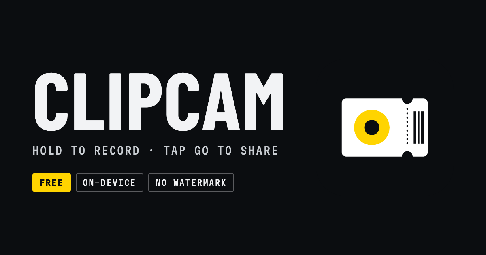

# Clipcam



Mobile-first web clips camera: **hold anywhere on the preview to record**, arrange clips on a filmstrip timeline, then tap **Go** to export or share one video — all **on your device**.

- **Free, every feature.** No subscription, no purchase, no watermark on your videos.
- **Private by construction.** No accounts, no uploads, no analytics, no tracking.
- **Works offline.** An installable PWA; projects live in the browser's own storage.
- **Open source.**

Made by **Sohail Khan** — [me.jscrate.dev](https://me.jscrate.dev).

## Quick start

```bash
npm install
npm run dev
```

Open the printed localhost URL in Chrome (desktop or Android). Camera and microphone require a **secure context** (`http://localhost` or HTTPS). Node **24.3+** is required.

```bash
npm run build      # typecheck + production build + service worker
npm run preview    # serve dist (PWA cache active)
npm test           # unit tests (Vitest browser mode, real Chromium)
npm run test:e2e   # Playwright e2e suite (fake camera/mic)
npm run test:smoke # Playwright UX smoke: record → edit → export
npm run icons      # regenerate every icon + the social card from public/logo.svg
```

For a phone on the same network, use your machine's LAN URL over HTTPS, or a tunnel (`npm run dev -- --host` plus a trusted tunnel). `getUserMedia` fails on plain `http://<lan-ip>` in most browsers.

## Features

Everything below is free and runs on the device.

### Capture
- Full-bleed live camera (rear preferred; flip, torch, and zoom when the device exposes them)
- Hold-to-record anywhere on the preview; drag up/down while holding to zoom
- Lens chip for ultra-wide/telephoto cameras where the browser exposes them
- **1080p High quality** by default, or Standard / Saver (720p) to save space — always 30 fps
- Self-timer for hands-free takes (tap to stop)
- Optional **location tagging** of new clips (off by default)
- Microphone chooser when more than one mic is connected; live "mic isn't picking up sound" warning
- **Screen recording** on desktop (screen, window, or tab, with mic narration)
- Recording feedback (REC pill + elapsed) that never re-renders the page per frame, so capture stays smooth

### Edit
- Filmstrip timeline: thumbnails sized by duration, drag to reorder, duplicate, split, delete with Undo
- **In-timeline trim** with drag handles
- Add clips and **photos** from your device; a photo becomes a still clip (3 s by default) with a free **Duration** control (0–30 s, presets, ±0.5 s steppers)
- **Per-clip audio**: every clip is peak-normalized automatically; a **Clip sound** slider sets each clip's own volume
- **Background music**: a playlist of tracks under the film, each with its own trim, volume, and fade in/out; a per-clip **Music** slider ducks the music during that clip. Previews play exactly what the export will contain
- **Landscape projects**: rotate the phone. An empty project follows how the device is held, and the first take locks the orientation. The whole interface adapts (record rail, side-by-side editor), and exports follow the project's orientation
- Crop or letterbox per clip when a clip doesn't match the film's shape
- Project preview playback: tap the edges to skip clips, the middle to stop

### Share
- Big **Go** button: on-device export to **one video file** (MP4 preferred), then Share (system sheet) or Save
- No watermark, ever
- Save original clips as a `.zip`
- **Backups**: one `.clipcam` file per project (clips, trims, location, music and volumes) — a safety net and the way to move projects between devices or browsers. Older `.kodyvideo` backups import too
- **Send to device**: a pairing code + QR introduces two browsers; the project travels over a WebRTC DataChannel. Clips never touch a server. Receive at `/receive`

### Projects
- Six stable project slots, each shown as a pass with its clip count, length, and size
- Projects that are new (imported or received) or changed since you last opened them stay highlighted until you open them
- Projects are created lazily: an untouched "New project" leaves nothing behind

## Design

Clipcam's interface is built on a **boarding pass & gate board** visual system:

- Ink and white panels, one **alert yellow** reserved for what's active or just changed, and a red dot only while recording
- Condensed mono uppercase labels (**Martian Mono**), monumental numerals (**Barlow Condensed**), and the system UI face for body text, all self-hosted so the app looks the same offline
- Tabular figures for every number, 1px hairline dividers, perforated sheet edges, no gradients or glows
- Light and dark themes follow the system setting; the camera stage is always dark

The logo (`public/logo.svg`) is the single source for every icon. `npm run icons` renders the favicon, Apple touch icon, PWA icons (including a real **maskable** icon with the art inside the 80% safe zone), and the 1200×630 social card with the Playwright Chromium the project already installs.

Product facts and principles live in [`PRODUCT.md`](./PRODUCT.md).

## Architecture

Built with [Remix 3](https://github.com/remix-run/remix) (`remix@3.0.0`, pinned) as a pure client-side app: `remix/component` components rendered with `createRoot`, no server rendering. Routing is a tiny in-app `history` router (`router.tsx`) rather than `remix/spa`, because a full document reload mid-recording is not acceptable for a camera app.

```
src/
  lib/storage.ts            IndexedDB (idb) — projects, clip blobs + thumbnails, undo
  lib/project-actions.ts    Loader/mutation helpers for pages
  lib/camera.ts             Camera controller (open/flip/zoom/lens/mic lifecycle)
  lib/recorder.ts           Hold-to-record MediaRecorder wrapper (hardware-codec aware)
  lib/media.ts              getUserMedia/permissions/share/download helpers
  lib/thumbs.ts             Filmstrip thumbnail generation (stored per clip)
  lib/sync-*.ts             Send to device (WebRTC + /api/sync matchmaker)
  lib/seen-projects.ts      Home "held change" highlight (per device)
  lib/sheet-modal.ts        Bottom-sheet modality (focus trap, Esc, sheet stack)
  lib/export/               Export engines (see below)
  components/record-screen  Camera surface (capture, zoom, timer, dock)
  components/editor-screen  Timeline, trim, clip actions
  pages/                    Home, Project (record/editor shell), About, Receive, legal
  router.tsx                Tiny client router (route-pattern matching + history)
functions/                  Cloudflare Pages Functions (sync matchmaker, diag, recover, agent markdown)
scripts/                    Icon generator, dev sync API, probes and smoke tests
```

### Export pipeline

`lib/export/` stitches clips into one file with two engines:

1. **Mediabunny + WebCodecs (preferred):** each clip's samples are demuxed and decoded directly by [Mediabunny](https://mediabunny.dev) (no playback pacing, hardware speed, works in background tabs, honors rotation metadata), composited onto one canvas, and encoded/muxed by Mediabunny. Audio is decoded per clip and appended **sample-accurately**, so audio never drifts. Output prefers **MP4 (H.264/HEVC + AAC)** and falls back to **WebM (VP9/VP8 + Opus)** only where MP4 encoders are missing.
2. **Realtime fallback:** `canvas.captureStream` + `MediaRecorder`, hardened with timeouts and degenerate-segment skipping, for browsers without WebCodecs.

`plan.ts` is a pure, unit-tested planner that clamps trims and drops unplayable segments. Export completes **first**; Share/Save then run on fresh taps so the Web Share API has the user activation it requires.

### Chapters & file metadata

MP4 exports carry **chapter markers** at every clip boundary (Nero `chpl`, injected post-mux by `lib/export/mp4-metadata.ts`) titled with each clip's time of day, plus QuickTime tags: the project title (`©nam`), a short composition note (`©cmt` / `©des`: clip and photo counts, duration, music), and an encoder credit (`©too`: Clipcam). Location and filming dates are **left out by default** so a public share never discloses where or when it was made; an export toggle adds dates and coordinates to chapter titles, a `©xyz` geotag, and a capture timestamp so photo libraries place the film correctly. Share and Save stamp `File.lastModified` from the last clip. WebM exports skip chapters (the WebM Matroska subset excludes them).

### Recording quality

- Phones prefer **hardware H.264** MediaRecorder types over software VP9 (software encoding drops frames on Android).
- Capture stays at **30 fps**. About → **Video quality** picks size/bitrate for *new* clips: **High** (1080p, default), **Standard** (720p), or **Saver** (720p, smaller bitrate).
- A live MediaRecorder is armed on the record screen so the hardware encoder is past its ~170 ms startup hole when you press; the take trims the pre-roll.
- Clip duration is measured from the encoded media after stop.
- The elapsed timer is a leaf component updated at 10 Hz, so the readout never re-renders the page during capture.
- Optional post-take work waits while a take is recording (`lib/capture-activity.ts`); zoom writes are coalesced (`lib/zoom-writer.ts`).
- Every take writes an on-device **recording-health report** (frame cadence, stalls, encoder/save timings). About → **Recording health** summarizes them; share or copy them yourself. See [`docs/recording-smoothness.md`](docs/recording-smoothness.md).
- A screen wake lock is held while recording and exporting.

### Remix data flow (explicit updates, no hooks)

- **Components** are Remix 3 setup + render functions: state lives in setup-scope variables; re-renders happen only on explicit `handle.update()`.
- **Pages own their data**: each page loads IndexedDB state in setup and exposes `refresh()`; mutations write storage then call `refresh()`.
- **Camera** attaches via the `ref()` mixin (start on insert, stop when the element's abort signal fires).
- **Blob URLs** bind/revoke in `ref()` mixins (`BlobVideo`, `BlobImage`, `TimelineThumbImage`).
- **Sheets** reset with `key={id}`; modality comes from `lib/sheet-modal.ts`.

### Storage

| Store    | Contents                                              |
|----------|-------------------------------------------------------|
| projects | JSON metadata + ordered `clipIds`                     |
| clips    | Clip metadata, `Blob` media, filmstrip thumbnails     |
| undo     | Last deleted clip per project (for Undo)              |
| meta     | Settings (`maxProjects`, last opened id, onboarding, video quality) |
| audio    | Background-music playlist per project (blobs, per-track trims/volumes/fades) |

The IndexedDB database keeps its original name, `kody-video`, so projects made before the rename keep working. Blobs never leave the device unless you share, save, back up, or send them.

### Offline / PWA

`vite-plugin-pwa` precaches the app shell (HTML, JS, CSS, icons, fonts). After the first visit:

1. Airplane mode still loads the app from Cache Storage.
2. Project and clip data come from IndexedDB.
3. A newer deploy never replaces the open UI; an "Update available" toast (or About → check) applies it on demand.

Verify with `npm run build && node scripts/probe-pwa-offline.mjs`, or `npm run preview`, load once, then go offline in DevTools and reload.

## Deploying

Clipcam deploys as static files plus a few Pages Functions on **Cloudflare Pages** (`npm run build`, output `dist/`). All app links are relative, so it works on any domain.

- Optional KV namespace binding **`SYNC_ROOMS`** enables Send to device matchmaking (room codes + WebRTC descriptions only, never media). Without it, Send shows a configuration error and Save backup still works.
- If the app ever opens to the hero with no project slots (a stale cached shell), two always-fresh pages help: `/api/diag` (read-only diagnostics) and `/api/recover` (drops the service worker and cached files; never touches IndexedDB).

## Browser limits

- **iOS Safari:** WebCodecs audio support is incomplete; the realtime fallback covers it, but Chromium (especially Android) is the primary target.
- **iOS microphone:** WebKit can deliver muted tracks when mic and camera come from separate `getUserMedia` calls, so on iOS the mic is acquired with the camera. External mics are nudged via `navigator.audioSession` (best effort; routing is OS-controlled).
- **Permissions:** a denied camera/mic must be re-enabled in site settings; the UI explains how.
- **Storage quotas:** large projects can hit IndexedDB quotas; the six-slot cap and the storage gauge help.
- **Ultra-wide (0.5×):** Android usually exposes extra lenses as separate cameras (the lens chip switches between them); some devices don't expose them to browsers at all.

## Desktop keyboard support

Hints appear automatically on fine-pointer devices.

- **Camera:** hold `Space` to record, `F` flip, `T` self-timer, `S` screen recording, `E` editor, `P` play, `Delete` remove last clip.
- **Editor:** `←`/`→` select clip, `Alt`+arrows reorder, `T` trim, `D` duplicate, `Delete` delete, `P` play, `Esc` back.
- **Playback:** `←`/`→` skip clips, `Space` pause/resume, `Esc` close.

## Privacy

- No accounts, no cookies, no analytics, no crash reporting, no cross-site tracking.
- No clip upload endpoints exist.
- Share and export use a user-gesture download or the Web Share API only.
- The only network call the app makes on its own is a short-lived `/api/sync` matchmaking room, and only when you tap Send to device.

## Scripts

| Command | Purpose |
|---------|---------|
| `npm run dev` | Vite dev server |
| `npm run build` | Typecheck + production bundle |
| `npm run preview` | Preview the production build |
| `npm test` | Vitest unit tests (browser mode, Chromium) |
| `npm run test:e2e` | Playwright e2e suite (`tests/e2e/`) |
| `npm run test:smoke` | Playwright smoke: record → edit → export |
| `npm run icons` | Render all icons + the social card from `public/logo.svg` |
| `node scripts/probe-export-chrome.mjs` | Export validation in Chrome stable (real codecs) |
| `node scripts/probe-keyboard.mjs` | Desktop keyboard flows |
| `node scripts/probe-rear-lens.mjs` | Rear lens switching with fake cameras |
| `node scripts/probe-fast-export.mjs` | Decode-driven export beats realtime |
| `node scripts/probe-mic-monitor.mjs` | Silent-mic warning fires and clears |
| `node scripts/probe-install-hint.mjs` | iOS install hint per user agent (needs `npm run build`) |
| `node scripts/probe-pwa-offline.mjs` | Offline / standalone cold start paints the shell (needs `npm run build`) |
| `node scripts/probe-screen-record.mjs` | Desktop screen recording lands as a clip |
| `node scripts/probe-touch-timeline.mjs` | Touch timeline gestures |
| `node scripts/probe-webkit.mjs` | WebKit engine sanity + feature matrix |

## Credits

Clipcam is built on [Kody Video](https://github.com/kentcdodds/kody-video) by Kent C. Dodds. Its hold-to-record interaction model is inspired by [OK Video](https://okvideo.app) by Pim Coumans. Clipcam is an independent project and is not affiliated with either.

## License

Licensed under the [Functional Source License, Version 1.1, ALv2 Future License](./LICENSE) ([FSL-1.1-ALv2](https://fsl.software/)), inherited from Kody Video. You may use, copy, modify, and redistribute the software for any purpose other than **Competing Use** — making it available to others in a commercial product or service that substitutes for the licensed software or offers substantially similar functionality. Each version becomes available under the Apache License 2.0 on the second anniversary of its release.
